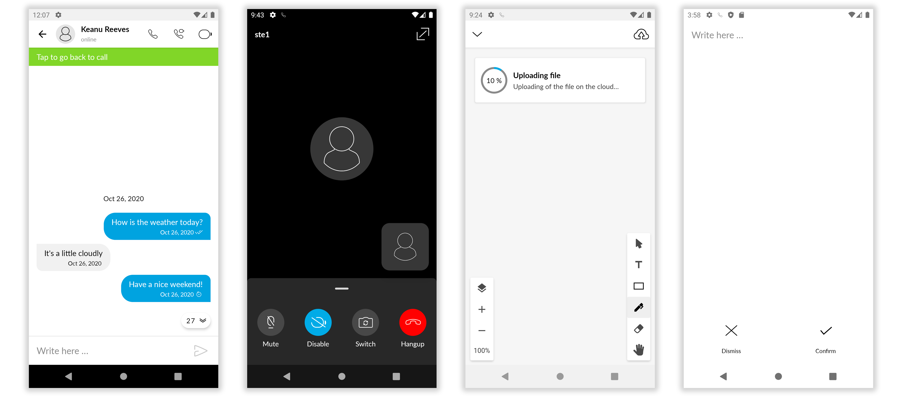

# Bandyer-Android-Design
This repository is the design library used by Bandyer's Android SDK

**Bandyer** is a young innovative startup that enables audio/video communication and collaboration from any platform and browser! Through its WebRTC architecture, it makes video communication simple and punctual.

## Overview

**Bandyer Android SDK** makes it easy to add video conference and chat communication to mobile apps.

**Even though this sdk encloses strongly the UI/UX, it is fully styleable through default Android style system.**

## Documentation

### Introduction
🏠  &nbsp; [Home](https://github.com/Bandyer/Bandyer-Android-Design/wiki/Home)

🎨  &nbsp; [Color System](https://github.com/Bandyer/Bandyer-Android-Design/wiki/Color-System)

🎑  &nbsp; [Customize Colors & Themes](https://github.com/Bandyer/Bandyer-Android-Design/wiki/Customize-Colors-&-Themes)

🆎  &nbsp; [Customize Font](https://github.com/Bandyer/Bandyer-Android-Design/wiki/Customize-Font)