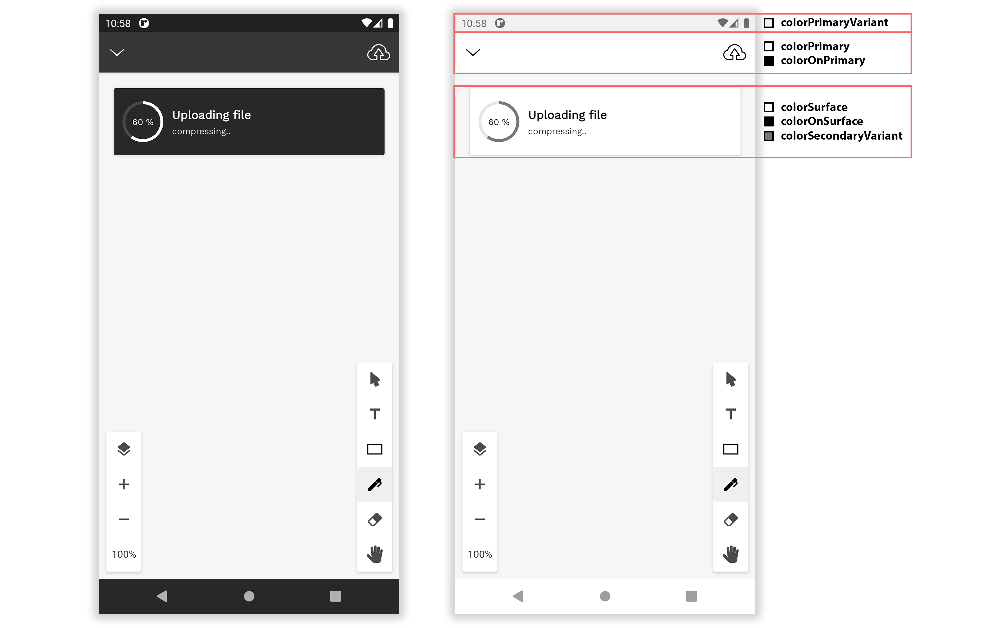

# Bandyer-Android-Design
This repository is the design library used by Bandyer's Android SDK

**Bandyer** is a young innovative startup that enables audio/video communication and collaboration from any platform and browser! Through its WebRTC architecture, it makes video communication simple and punctual.

## Overview

**Bandyer Android SDK** makes it easy to add video conference and chat communication to mobile apps.

**Even though this sdk encloses strongly the UI/UX, it is fully stylable through default Android style system.**

# Basic personalization
---

.**[Call](#call)** .
**[Chat](#chat)** .
**[Whiteboard](#whiteboard)** .
**[TextEditor](#texteditor)** .

---

## Call

## Chat 

## Whiteboard

## TextEditor

