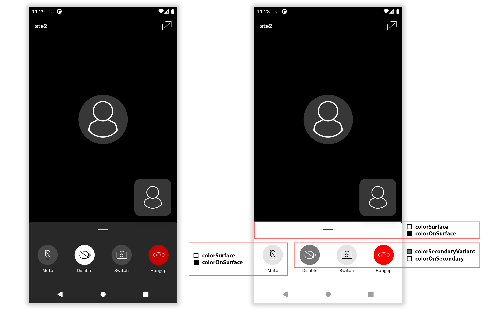
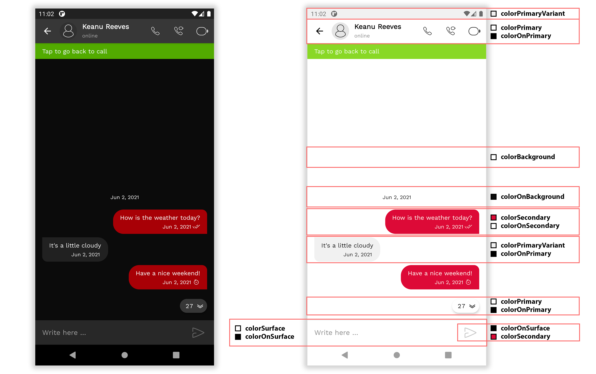

# Bandyer-Android-Design
This repository is the design library used by Bandyer's Android SDK

<p align="center">

</p>


[  ](https://bintray.com/bandyer/Communication/Android-Design/_latestVersion)
[](https://twitter.com/intent/follow?screen_name=bandyersrl)


**Bandyer** is a young innovative startup that enables audio/video communication and collaboration from any platform and browser! Through its WebRTC architecture, it makes video communication simple and punctual.

## Overview

**Bandyer Android SDK** makes it easy to add video conference and chat communication to mobile apps.

**Even though this sdk encloses strongly the UI/UX, it is fully stylable through default Android style system.**

# Basic personalization
---

**[Enable DayNight](#enable-daynight)** .
**[Customize Colors&Fonts](#customize-colorsfonts)** .

---

## Enable DayNight
Override the following styles in your values/themes.xml

```xml
    <style name="BandyerSDKDesign.Theme.Call" parent="BandyerSDKDesign.Theme.Call.DayNight">
    <style name="BandyerSDKDesign.Theme.Chat" parent="BandyerSDKDesign.Theme.Chat.DayNight">
```

## Customize Colors&Fonts

**[Call](#call)** .
**[Chat](#chat)** .
**[Whiteboard](#whiteboard)** .
**[TextEditor](#texteditor)** .

Override the following styles in your values/themes.xml.

Change the properties you desire (see screenshots below for more information).

Default colors used can be found here [colors.xml](https://github.com/Bandyer/Bandyer-Android-Design/blob/main/bandyer-android-design/src/main/res/values/colors.xml)

```xml
 <style name="BandyerSDKDesign.Theme" parent="Theme.MaterialComponents.DayNight.NoActionBar">
        <item name="colorSecondary">@color/bandyer_colorSecondary</item>
        <item name="colorOnSecondary">@color/bandyer_colorOnSecondary</item>
        <item name="colorError">@color/bandyer_colorError</item>
        <item name="android:statusBarColor" tools:targetApi="lollipop">?attr/colorPrimaryVariant</item>
        <item name="colorControlNormal">?attr/colorOnPrimary</item>
        <item name="fontFamily">@font/bandyer_font</item>
        <item name="android:fontFamily">@font/bandyer_font</item>
        <item name="elevationOverlayEnabled">false</item>
        <item name="toolbarStyle">@style/BandyerSDKDesign.ToolBarStyle</item>
    </style>

    <style name="BandyerSDKDesign.ToolBarStyle" parent="Widget.MaterialComponents.Toolbar.Primary">
        <item name="android:textColor">?attr/colorOnPrimary</item>
    </style>

    <style name="BandyerSDKDesign.Theme.Day" parent="BandyerSDKDesign.Theme">
        <item name="colorPrimary">@color/bandyer_colorPrimary</item>
        <item name="colorPrimaryVariant">@color/bandyer_colorPrimaryVariant</item>
        <item name="colorSecondaryVariant">@color/bandyer_colorSecondaryVariant</item>
        <item name="colorSurface">@color/bandyer_colorSurface</item>
        <item name="colorOnPrimary">@color/bandyer_colorOnPrimary</item>
        <item name="colorOnSurface">@color/bandyer_colorOnSurface</item>
        <item name="colorOnBackground">@color/bandyer_colorOnBackground</item>
        <item name="android:colorBackground">@color/bandyer_colorBackground</item>
        <item name="android:windowBackground">@color/bandyer_colorBackground</item>
        <item name="android:windowLightStatusBar" tools:targetApi="m">true</item>
    </style>

    <style name="BandyerSDKDesign.Theme.Night" parent="BandyerSDKDesign.Theme">
        <item name="colorPrimary">@color/bandyer_colorPrimary_night</item>
        <item name="colorPrimaryVariant">@color/bandyer_colorPrimaryVariant_night</item>
        <item name="colorSecondaryVariant">@color/bandyer_colorSecondaryVariant_night</item>
        <item name="colorSurface">@color/bandyer_colorSurface_night</item>
        <item name="colorOnPrimary">@color/bandyer_colorOnPrimary_night</item>
        <item name="colorOnSurface">@color/bandyer_colorOnSurface_night</item>
        <item name="colorOnBackground">@color/bandyer_colorOnBackground_night</item>
        <item name="android:colorBackground">@color/bandyer_colorBackground_night</item>
        <item name="android:windowBackground">@color/bandyer_colorBackground_night</item>
        <item name="android:windowLightStatusBar" tools:targetApi="m">false</item>
    </style>

```


### Call


### Chat 


### Whiteboard


### TextEditor

